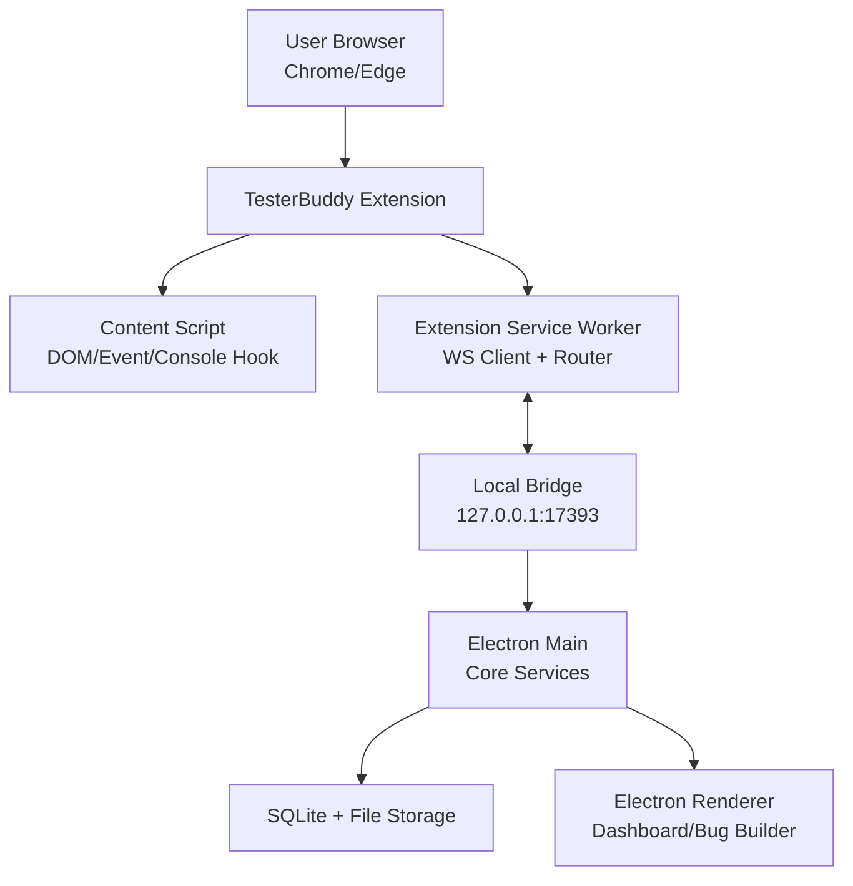
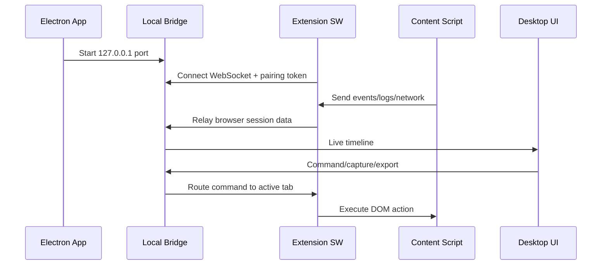

# TesterBuddy — Browser-Connected QA Assistant

> Last updated: 2026-06-25

## Core Idea

```
Electron App = control center + storage + export + agent brain
Extension    = eyes/hands inside real browser tab
Local Bridge = realtime pipe between them
```

**Bỏ Playwright.** Hướng đúng là:

- **TesterBuddy Desktop** chạy local server
- **Browser Extension** bám vào browser thật của user
- User đang login sẵn Jira, staging, admin panel, app nội bộ → capture đúng session thật, không phải mở browser riêng

---

## Architecture



### Connection Flow



---

## Monorepo Structure

```
testerbuddy/
  apps/
    desktop/
      src/
        main/
          app.ts
          bridge/
            local-server.ts
            websocket-hub.ts
            pairing.service.ts
            extension-session-registry.ts
          services/
            bug/
            capture/
            export/
            project/
            agent/
              agent-command.service.ts
              browser-control.service.ts
          ipc/
          storage/
        renderer/
          features/
            live-session/
            bug-reporter/
            project-workspace/
            settings/
        preload/

    extension/
      src/
        manifest.ts
        service-worker/
          index.ts
          ws-client.ts
          router.ts
          tab-registry.ts
        content/
          index.ts
          event-recorder.ts
          dom-inspector.ts
          console-hook.ts
          network-hook.ts
          page-bridge.ts
          overlay.ts
        injected/
          fetch-xhr-hook.ts
          console-proxy.ts
          history-hook.ts
        popup/
        sidepanel/

  packages/
    protocol/
      src/
        messages.ts
        schemas.ts
        channels.ts
    shared/
      src/
        types/
        utils/
```

---

## Protocol Design

```ts
type BrowserEvent =
  | { type: "tab.connected"; tabId: number; url: string; title: string }
  | { type: "user.click"; selector: string; text?: string; x: number; y: number }
  | { type: "user.input"; selector: string; valuePreview: string }
  | { type: "navigation"; from: string; to: string }
  | { type: "console.error"; message: string; stack?: string }
  | { type: "network.request"; requestId: string; method: string; url: string }
  | { type: "network.response"; requestId: string; status: number; durationMs: number }
  | { type: "screenshot.captured"; fileId: string };

type BrowserCommand =
  | { type: "capture.visibleTab" }
  | { type: "highlight.element"; selector: string }
  | { type: "click"; selector: string }
  | { type: "type"; selector: string; text: string }
  | { type: "read.dom"; selector?: string }
  | { type: "get.pageContext" };
```

---

## Module Responsibilities

### Browser Extension

| Module            | Làm gì                                                         |
| ----------------- | -------------------------------------------------------------- |
| `service-worker`  | Giữ WS, route message, quản lý tab/session                     |
| `content-script`  | Ghi click/input/navigation, đọc DOM, tạo overlay               |
| `injected-script` | Hook `fetch`, `XMLHttpRequest`, `console`, `history.pushState` |
| `popup/sidepanel` | Connect status, chọn project, start/stop session               |
| `overlay`         | Highlight element, show recording status, quick note           |

### Electron Desktop

| Module             | Làm gì                                         |
| ------------------ | ---------------------------------------------- |
| `local-server`     | Mở `127.0.0.1:<port>` HTTP/WS                  |
| `pairing.service`  | Pair extension với desktop bằng token          |
| `session-registry` | Biết tab nào đang active, url nào, project nào |
| `bug.service`      | Tạo bug từ timeline + screenshot + log         |
| `capture.service`  | Nhận screenshot/video/blob từ extension        |
| `agent.service`    | Sau này sinh command điều khiển browser        |
| `export.service`   | Markdown/HTML/Jira/GitHub export               |

---

## Network Capture Strategy

| Cách                                  | Ưu                                | Nhược                                      |
| ------------------------------------- | --------------------------------- | ------------------------------------------ |
| Hook `fetch/XHR` bằng injected script | Dễ lấy request/response app-level | Không bắt được mọi request, khó với binary |
| `chrome.webRequest`                   | Quan sát traffic tốt hơn          | Permission nhạy cảm, response body khó lấy |
| `chrome.debugger` sau này             | Mạnh, gần DevTools Protocol       | Permission rất nhạy, UX phải xin rõ        |

**MVP dùng:** fetch/XHR hook + console hook + DOM event recorder

---

## Security Requirements

```
- Chỉ bind 127.0.0.1, không bind 0.0.0.0
- Mỗi app install sinh pairing token riêng
- Extension phải gửi token khi connect WS
- Validate mọi message bằng Zod
- Giới hạn origin/extension id được phép connect
- Không log full token/cookie/password
- Redact input type=password, authorization header, cookie
- User phải bật recording theo tab/project
```

---

## Agent Control (sau MVP)

```
Agent -> Desktop agent service
Desktop -> WS command
Extension SW -> active tab content script
Content script -> DOM action: click/type/scroll/read/highlight
Result -> timeline + screenshot + DOM snapshot
```

### Known Limitations

```
- Không tự do vượt cross-origin iframe
- Không đọc HttpOnly cookie
- Không control native browser UI (address bar, download dialog)
- Shadow DOM/canvas cần strategy riêng
- Một số site CSP/cross-origin sẽ cần fallback
```

---

## MVP Scope

```
1. Electron app start local bridge
2. Chrome/Edge extension connect bằng pairing token
3. Start/stop testing session theo active tab
4. Record click/input/navigation/console/fetch-XHR
5. Capture visible tab screenshot
6. Timeline viewer trong desktop
7. Generate bug report từ timeline
8. Export Markdown/HTML
```

---

## WebSocket in Chrome Extensions

- Content scripts, service worker, và runtime messaging đều dùng được
- Từ Chrome 116: WebSocket activity giữ service worker active nếu có message đều
- Native Messaging là option chính thức để extension nói chuyện với app local (long-term option)

---

## Product Identity

> **Browser-Connected QA Assistant** — không phải Electron-only tool  
> Dùng browser thật, session thật, evidence thật  
> Mở đường cho agent điều khiển sau này
